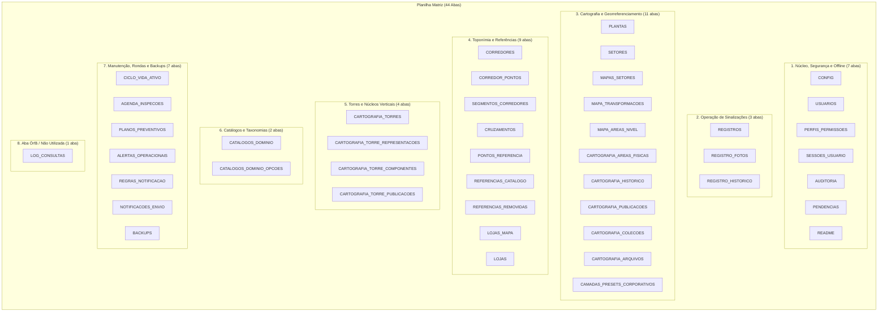

# 📊 Mapeamento Completo e Diagnóstico de Uso das Abas da Planilha Matriz

> **Aplicação:** Sinalização do Mall  
> **Baseline Oficial:** `MVP-3.32.0-SINALIZACAO-S26.10` (Fase `S26.10`)  
> **Planilha Matriz Avaliada:** [1j5bYY-0JpbLd95FyV19lyRPSG6j9kpoM8UCCWZjKchs](https://docs.google.com/spreadsheets/d/1j5bYY-0JpbLd95FyV19lyRPSG6j9kpoM8UCCWZjKchs/edit?gid=577450038#gid=577450038)  
> **Data do Diagnóstico:** Setembro/2026  

---

## 1. Conclusão Executiva

A aplicação **NÃO utiliza 100% das abas** da planilha matriz.

- **Total de abas na planilha matriz:** `44 abas`
- **Abas ativas e em pleno uso:** `43 abas` (97,7%)
- **Abas descontinuadas / órfãs (sem uso):** `1 aba` (`LOG_CONSULTAS`) (2,3%)
- **Abas externas complementares:** A tabela `LOJISTAS` é operada via planilha mestre externa vinculada (`LOJISTAS_SPREADSHEET_ID`), não residindo dentro das 44 abas da matriz de sinalização.

A aba `LOG_CONSULTAS` (GID `1398037710`) é um resíduo de fase preliminar de desenvolvimento (S3/S4), contendo apenas a linha de cabeçalho e zero registros. O registro de operações e segurança do sistema foi consolidado e centralizado na aba `AUDITORIA` a partir da fase S15.

---

## 2. Quadro Matriz: Utilização das 44 Abas da Planilha

A tabela a seguir apresenta todas as 44 abas identificadas na planilha matriz, seu identificador interno (GID), status de uso no código-fonte (`src/`), módulo responsável, arquivos principais e finalidade operacional.

| # | Nome da Aba | GID | Em Uso? | Domínio / Módulo | Arquivos Principais no Código | Finalidade Operacional e Fluxo de Dados |
|:---:|:---|:---:|:---:|:---|:---|:---|
| 1 | **CONFIG** | `577450038` | **SIM** | Core / Configuração Global | `Código.gs`, `SetupService.gs`, `ClonarBaseSetor.gs`, `ReleaseS2610F2.gs` | Parâmetros de ambiente (chave/valor), IDs de pastas no Drive, `APP_VERSAO`, `APP_FASE`, fuso horário e flags de controle. |
| 2 | **REGISTROS** | `37717636` | **SIM** | Operação / Sinalizações (SIG) | `MapService.gs`, `OfflineService.gs`, `RelatorioSlidesService.gs`, `scripts.html` | Tabela mestre operacional contendo todas as sinalizações: código SIG, coordenadas normalizadas (X,Y), setor, nível, status e dados físicos. |
| 3 | **REGISTRO_FOTOS** | `1573793882` | **SIM** | Operação / Mídia e Fotos | `OfflineService.gs`, `RelatorioSlidesService.gs`, `scripts.html` | Metadados e IDs/URLs do Drive de fotos anexadas aos registros de sinalização (fotos de campo, vistorias e evidências). |
| 4 | **REGISTRO_HISTORICO** | `586755890` | **SIM** | Operação / Trilha dos Registros | `MapService.gs`, `OfflineService.gs`, `RelatorioSlidesService.gs` | Log cumulativo de ciclo de vida de cada sinalização (criação, edições, vistorias periódicas, exclusão operacional). |
| 5 | **USUARIOS** | `2012291127` | **SIM** | Segurança / Gestão de Usuários | `AcessoMovelS2611A2.gs`, `OfflineService.gs`, `ClonarBaseSetor.gs` | Cadastro de colaboradores autorizados, e-mail Google, perfis (`ADMIN`, `OPERADOR`, `CONSULTA`), setor padrão e flag de ativação. |
| 6 | **PERFIS_PERMISSOES** | `1501156486` | **SIM** | Segurança / Matriz RBAC | `OfflineService.gs`, `CatalogosDominioAdminS269B2.gs` | Tabela mestre de permissões por perfil (administrar, cadastrar, inspecionar, visualizar). |
| 7 | **SESSOES_USUARIO** | `2104880322` | **SIM** | Segurança / Autenticação Móvel | `AcessoMovelS2611A2.gs`, `BackupService.gs`, `scripts.html` | Sessões ativas de login e tokens/PINs de operadores em dispositivos móveis no campo. |
| 8 | **AUDITORIA** | `476886573` | **SIM** | Segurança / Trilha de Auditoria | `OfflineService.gs`, `BackupService.gs`, `TorresGovernancaS2610F.gs` | Registro oficial e imutável de todas as ações críticas do sistema (S15): logins, cadastros, alterações de status e backups. |
| 9 | **PENDENCIAS** | `465661518` | **SIM** | Offline-First / Fila de Sync (Outbox) | `OfflineService.gs`, `scripts.html` | Fila de requisições e inspeções salvas offline no IndexedDB aguardando sincronização com a planilha. |
| 10 | **PLANTAS** | `373002839` | **SIM** | Cartografia / Plantas e Pavimentos | `CartografiaService.gs`, `Cartografia2025Service.gs`, `MapService.gs` | Metadados das plantas baixas dos pavimentos (N0 Subsolo, N1, N2, N3 e setores), dimensões em pixels e URLs de imagem. |
| 11 | **SETORES** | `422865564` | **SIM** | Cartografia / Zonas do Mall | `CartografiaService.gs`, `BackupService.gs` | Cadastro das zonas operacionais do shopping (Setor Azul, Verde, Amarelo, Branco, Vermelho, Roxo, etc.). |
| 12 | **MAPAS_SETORES** | `908103944` | **SIM** | Cartografia / Calibração Setorial | `MapService.gs`, `CartografiaService.gs`, `TorresResolverS2610D.gs` | Relação de mapas por setor, limites operacionais e fatores de escala/zoom. |
| 13 | **MAPA_TRANSFORMACOES** | `1049513638` | **SIM** | Cartografia / Calibração Setor ➔ Nível | `Cartografia2025Service.gs`, `SetupService.gs` | Matrizes afins 2D (escala, rotação, translação) que convertem coordenadas locais de setores em coordenadas dos Níveis 2025. |
| 14 | **MAPA_AREAS_NIVEL** | `2013423284` | **SIM** | Cartografia / Enquadramentos de Nível | `Cartografia2025Service.gs`, `TorresResolverS2610D.gs`, `SetupService.gs` | Polígonos vetoriais JSON de áreas operacionais e enquadramentos inteligentes nos Níveis 2025. |
| 15 | **CARTOGRAFIA_AREAS_FISICAS** | `156581487` | **SIM** | Cartografia / Áreas Físicas (S26.8-D2) | `Cartografia2025Service.gs`, `SetupService.gs` | Mapeamento físico real no Subsolo (N0): vagas de estacionamento B01-B06, rampas R01-R02, corredores C01-C10. |
| 16 | **CARTOGRAFIA_HISTORICO** | `1752132936` | **SIM** | Cartografia / Versionamento de Mapas | `CartografiaService.gs`, `SetupService.gs` | Trilha de histórico de versões, rascunhos e publicações da cartografia do mall. |
| 17 | **CARTOGRAFIA_PUBLICACOES** | `1450516040` | **SIM** | Cartografia / Publicações Oficiais | `CartografiaService.gs`, `SetupService.gs` | Snapshots imutáveis e versões homologadas da cartografia oficial disponibilizada no Web App. |
| 18 | **CARTOGRAFIA_COLECOES** | `272111029` | **SIM** | Cartografia / Coleções de Camadas | `CartografiaService.gs`, `BackupService.gs` | Agrupamento lógico de camadas temáticas e coleções de elementos vetoriais. |
| 19 | **CARTOGRAFIA_ARQUIVOS** | `1181736429` | **SIM** | Cartografia / Catálogo de Arquivos | `CartografiaService.gs`, `BackupService.gs` | Catálogo de arquivos vetoriais, mapas brutos e SVGs armazenados no Google Drive. |
| 20 | **CAMADAS_PRESETS_CORPORATIVOS**| `1372286017` | **SIM** | Central de Camadas / Presets (S26.6) | `PresetsCamadasService.gs`, `SetupService.gs`, `scripts.html` | Presets de visualização do mapa (camadas ativas, filtros, estilos) definidos pela administração para cada perfil. |
| 21 | **CORREDORES** | `1428533830` | **SIM** | Toponímia / Vias de Circulação | `MapService.gs`, `BackupService.gs`, `OfflineService.gs` | Nomes oficiais e descritivos das ruas e corredores de circulação do shopping. |
| 22 | **CORREDOR_PONTOS** | `1554020854` | **SIM** | Toponímia / Vértices de Corredores | `MapService.gs`, `BackupService.gs`, `OfflineService.gs` | Coordenadas geométricas normalizadas dos nós dos corredores para cálculo de proximidade e snap de pin. |
| 23 | **SEGMENTOS_CORREDORES** | `47861108` | **SIM** | Toponímia / Trechos de Corredores | `MapService.gs`, `BackupService.gs`, `OfflineService.gs` | Segmentos lineares que conectam os nós de corredores, determinando o trecho automático da sinalização. |
| 24 | **CRUZAMENTOS** | `416969571` | **SIM** | Toponímia / Interseções | `MapService.gs`, `Cartografia2025Service.gs`, `BackupService.gs` | Interseções entre corredores utilizadas no preenchimento do campo de cruzamento da localização. |
| 25 | **PONTOS_REFERENCIA** | `142231403` | **SIM** | Central de Referências / Marcos | `ReferenciaCentralS2610R2.gs`, `GateS2610R1ReferenciasService.gs`, `MapService.gs` | Pontos notáveis espaciais do mall (escadas rolantes, banheiros, praças, totens, acessos). |
| 26 | **REFERENCIAS_CATALOGO** | `1525944992` | **SIM** | Central de Referências / Taxonomia | `ReferenciaCatalogosS2610R8.gs`, `GateS2610F1Consolidado.gs` | Taxonomia oficial de Tipos, Subtipos e cores associadas às referências espaciais (S26.10-R8). |
| 27 | **REFERENCIAS_REMOVIDAS** | `123351966` | **SIM** | Central de Referências / Tombstones | `ReferenciaCentralS2610R6C.gs`, `GateS2610F1Consolidado.gs` | Tabela de 'tombstones' que propaga exclusões lógicas de referências para limpeza do cache IndexedDB móvel. |
| 28 | **LOJAS_MAPA** | `419233438` | **SIM** | Toponímia / Lojas Georreferenciadas | `MapService.gs`, `Cartografia2025Service.gs`, `BackupService.gs` | Posições espaciais e portas de lojas nos mapas dos setores para inferência de lojas próximas ao pin. |
| 29 | **LOJAS** | `2031214783` | **SIM** | Toponímia / Cadastro Mestre de Lojas | `MapService.gs`, `BackupService.gs`, `scripts.html` | Cadastro descritivo alfanumérico de lojas e quiosques (LUC, razão social, nome fantasia, categoria). |
| 30 | **CARTOGRAFIA_TORRES** | `410031727` | **SIM** | Torres Verticais / Cadastro (S26.10) | `TorresEditorS2610C.gs`, `TorresDiagnosticoS2610A.gs`, `TorresIntegracaoS2610G.gs` | Cadastro dos núcleos de circulação vertical (escadas rolantes, elevadores, escadas de emergência). |
| 31 | **CARTOGRAFIA_TORRE_REPRESENTACOES** | `1216680390` | **SIM** | Torres Verticais / Posições nos Pisos | `TorresEditorS2610C.gs`, `TorresResolverS2610D.gs`, `TorresOfflineS2610E.gs` | Mapeamento geométrico e posições onde cada torre vertical aparece em cada pavimento (N0 a N3). |
| 32 | **CARTOGRAFIA_TORRE_COMPONENTES** | `634859045` | **SIM** | Torres Verticais / Componentes | `TorresEditorS2610C.gs`, `TorresDiagnosticoS2610A.gs` | Componentes físicos das torres (degraus, botoeiras, portas, patamares, sinalizações internas). |
| 33 | **CARTOGRAFIA_TORRE_PUBLICACOES** | `989773476` | **SIM** | Torres Verticais / Governança | `TorresGovernancaS2610F.gs` | Snapshots de governança, aprovação e publicação de núcleos verticais. |
| 34 | **CATALOGOS_DOMINIO** | `1630816272` | **SIM** | Catálogos de Domínio / Schema (S26.9) | `CatalogosDominioServiceS269B1.gs`, `CatalogosDominioAdminS269B2.gs` | Definição das listas controladas e vocabulários oficiais (Tipo de Sinalização, Finalidade, Estado, Condição). |
| 35 | **CATALOGOS_DOMINIO_OPCOES** | `1179158188` | **SIM** | Catálogos de Domínio / Opções (S26.9) | `CatalogosDominioServiceS269B1.gs`, `CatalogosDominioAdminS269B2.gs` | Valores válidos e selecionáveis de cada catálogo de domínio com cores, ícones e ordem de exibição. |
| 36 | **CICLO_VIDA_ATIVO** | `726158771` | **SIM** | Manutenção / Ciclo de Vida do Ativo | `BackupService.gs`, `TorresIntegracaoS2610G.gs` | Controle de vida útil, datas de garantia, revisões e depreciação dos equipamentos e placas. |
| 37 | **AGENDA_INSPECOES** | `1340295092` | **SIM** | Manutenção / Rondas Periódicas | `BackupService.gs`, `OfflineService.gs` | Cronograma de vistorias periódicas de campo atribuídas às equipes de operações. |
| 38 | **PLANOS_PREVENTIVOS** | `230672567` | **SIM** | Manutenção / Planos Preventivos | `BackupService.gs` | Definição de rotinas preventivas e procedimentos operacionais padrão. |
| 39 | **ALERTAS_OPERACIONAIS** | `64012953` | **SIM** | Manutenção / Ocorrências e Alertas | `BackupService.gs` | Registro de não-conformidades identificadas em vistorias de sinalização exigindo ação corretiva. |
| 40 | **REGRAS_NOTIFICACAO** | `1530810523` | **SIM** | Manutenção / Gatilhos de Alerta | `BackupService.gs` | Configuração de regras automáticas para envio de alertas por e-mail quando ocorrem não-conformidades. |
| 41 | **NOTIFICACOES_ENVIO** | `1845949030` | **SIM** | Manutenção / Fila e Log de Envios | `BackupService.gs` | Log e fila de notificações enviadas pela aplicação para os responsáveis por setor. |
| 42 | **BACKUPS** | `978706887` | **SIM** | Manutenção / Backups S16 | `BackupService.gs`, `SetupService.gs` | Histórico dos backups automáticos gerados com hash SHA-256 de integridade e links das planilhas no Drive. |
| 43 | **README** | `1259341697` | **SIM** | Documentação / Metadados de Versão | `MapService.gs`, `OfflineService.gs`, `CartografiaService.gs` | Aba documental gerada pelo Setup com resumo da versão, fase e orientações de operação da planilha. |
| 44 | **LOG_CONSULTAS** | `1398037710` | **NÃO** | *Descontinuada / Resíduo Preliminar* | *Nenhum arquivo no código (.gs ou .html)* | Aba órfã de protótipo inicial (S3/S4) com cabeçalhos de consultas espaciais, contendo 0 linhas de dados. Substituída pela aba `AUDITORIA` (S15). |

---

## 3. Agrupamento por Domínio Arquitetural

---

## 4. Recomendações de Governança e Boas Práticas

1. **Preservação das 43 Abas Ativas:**
   - As 43 abas em uso são estritamente necessárias para a integridade dos diagnósticos de release (`ReleaseS2610F2.gs`), funcionamento offline (IndexedDB) e rotinas de provisionamento de novos setores (`ClonarBaseSetor.gs`).
   - Nenhuma dessas 43 abas deve ser renomeada ou excluída.

2. **Destino da Aba `LOG_CONSULTAS`:**
   - Como possui 0 registros de dados e nenhuma referência no código-fonte, a aba pode ser:
     - **Opção A (Conservadora - Recomendada):** Mantida oculta (*Hide Sheet*) na planilha modelo para preservar histórico sem poluir a barra de abas inferior.
     - **Opção B (Limpeza):** Excluída da planilha modelo caso o comitê de governança opte por sanitização plena de resíduos legados.
